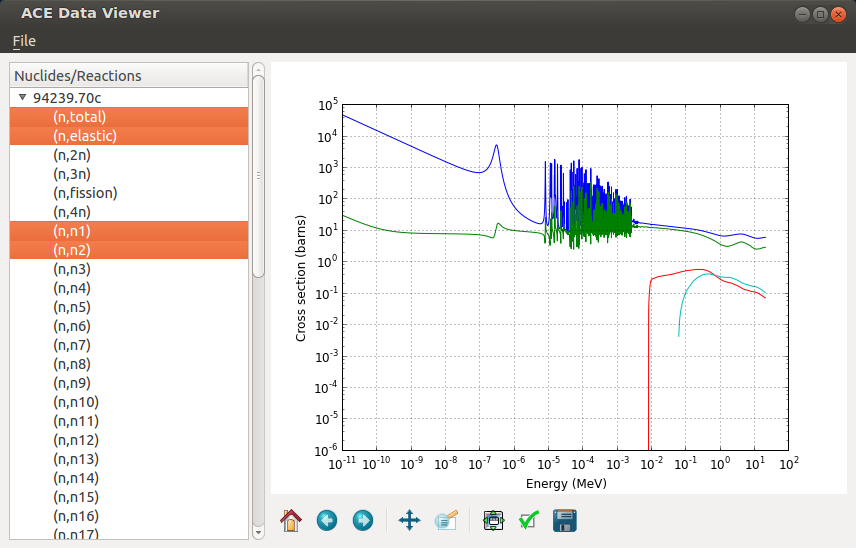

ANS Winter 2012
==============================

.. container:: main-title

    PyNE: Nuclear Engineering Toolkit

.. container:: main-names

    November 12th, 2012, San Diego, CA

    Anthony Scopatz*, Paul Romano, Kathryn Huff, Paul Willson 

    The Univ. of Chicago, MIT, Univ. Wisconsin - Madison

    \*scopatz@gmail.com

What is PyNE?
==============================
PyNE is a free & open source nuclear engineering toolkit.

.. break

It aims to be **fast** and **usable**.

.. break

Here is our software stack:

.. raw:: pdf

    Spacer 0 35

.. image:: img/stack1.png
    :scale: 400%
    :align: center

What is PyNE?
==============================
PyNE is a free & open source nuclear engineering toolkit.

It aims to be **fast** and **usable**.

Here is our software stack:

.. raw:: pdf

    Spacer 0 35

.. image:: img/stack2.png
    :scale: 400%
    :align: center

What is PyNE's Goal?
==============================
As a toolkit, PyNE is the substrate on which 
nuclear science and engineering problems are solved.  

.. break

The goal is to be **useful**.  Therefore new development takes an engineering 
approach with three main thrusts:

.. break

    * Data structures

.. break

    * Algorithms

.. break

    * Nuclear Data 

What is PyNE's Purpose?
==============================
As a free & open project, we want people (grad students) to stop 
*constantly* reinventing the wheel. |no-wheel|

.. break

The wheel that we do invent will be natural, fast, tested, documented, and 
reproducible.  We are not afraid of scope explosion!

.. break

This will allow *everyone* to shorten development time by more 
quickly being able to spin up new students, test new ideas, contribute 
back, and publish.

.. break

This means less overhead for maintanence and bug fixes.

..  |no-wheel| image:: img/no-wheel.jpg
                :scale: 100%

Whirlwind Tour!
==============================

.. container:: main-title

    Data Structures

Materials
==============================
PyNE materials are the primary object for sets of radionuclides, 
inspired by NumPy arrays and Python dicts.

.. break

.. code-block:: python

    In [1]: from pyne.material import Material

    In [2]: leu = Material({'U238': 0.96, 'U235': 0.04}, 42)

    In [3]: leu
    Out[3]: pyne.material.Material({922350: 0.04, 922380: 0.96}, 42.0, -1.0, {})

    In [4]: nucvec = {10010:  1.0, 80160:  1.0, 691690: 1.0, 922350: 1.0,
       ...:           922380: 1.0, 942390: 1.0, 942410: 1.0, 952420: 1.0,
       ...:           962440: 1.0}

    In [5]: mat = Material(nucvec)

    In [6]: weird_mat = leu + mat * 18

    In [7]: leu.comp[922350]
    Out[7]: 0.04

    In [8]: leu['U235']
    Out[8]: 1.68

    In [9]: weird_mat['U':'Am']
    Out[9]: pyne.material.Material({922350: 0.0736, 922380: 0.8464, 942390: 0.04, 942410: 0.04}, 50.0, -1.0, {})

Cross Section Formats (ACE)
==============================
We are developing readers and translators for standard cross section 
file formats from open publications.  (No one should have to do this 
twice).    ACE is the most mature.

.. break

Industry Standard I/O
==============================
Additionally, we have I/O routines for a number of industry stadard codes:

.. break

* ORIGEN 2.2

.. break

* Serpent

.. break

* MCNP

.. break

* NJOY

.. break

This is important! |no-wheel|

Whirlwind Tour!
==============================

.. container:: main-title

    Nuclear Data

Nucelar Data
==============================
Data distribution is as imporant as code distribution.

.. break

PyNE provides utilities for  managing basic data.

.. break

We have identified three orthoganal tiers of data:

.. break

.. raw:: pdf

    Spacer 0 65

Data Supported
==============================
.. container:: gray-and-small

    \* == redistributable, ! == closed:

.. break

* Atomic masses (\*), from Atomic Mass Data Center

.. break

* Decay data from ENSDF, IAEA

.. break

* Neutron scattering lengths (\*), NIST

.. break

* KAERI cross section and isotopic abundances (\*)

.. break

* Materials Compendium (\*), PNNL

.. break

* EAF cross sections, IAEA

.. break
 
* Cinder cross sections (!), Cinder/MCNP

Data Interface
==============================
PyNE also provides a high-level API to most data.

.. break

.. code-block:: python

    In [1]: from pyne import data

    In [2]: data.half_life(922350)
    Out[2]: 2.22165504e+16

    In [3]: data.atomic_mass('Pu-239')
    Out[3]: 239.052164844

    In [4]: c13 = data.natural_abund(60130)                    

Data Interface
==============================
.. raw:: pdf

    Spacer 0 75

.. code-block:: python

    In [11]: from pyne.xs.data_source import EAFDataSource

    In [12]: eds = EAFDataSource()

    In [17]: eds.reaction('U235', '2n')[:40]
    Out[17]: 
    array([ 0.172965  ,  0.226392  ,  0.250503  ,  0.293399  ,  0.389548  ,
            0.428117  ,  0.464678  ,  0.502925  ,  0.551846  ,  0.610356  ,
            0.706833  ,  0.761946  ,  0.820321  ,  0.835057  ,  0.825195  ,
            0.796091  ,  0.742308  ,  0.685149  ,  0.62169   ,  0.556779  ,
            0.501671  ,  0.457633  ,  0.424061  ,  0.386623  ,  0.346846  ,
            0.305083  ,  0.21849   ,  0.114091  ,  0.0347829 ,  0.00153177,
            0.        ,  0.        ,  0.        ,  0.        ,  0.        ,
            0.        ,  0.        ,  0.        ,  0.        ,  0.        ])

Whirlwind Tour!
==============================

.. container:: main-title

    Algorithms

ORIGEN Parameter Sweep
=============================
.. raw:: pdf

    Spacer 0 40

.. code-block:: python

    from subprocess import check_call

    from pyne import origen22
    from pyne.api import Material

    # 1 kg of water
    water = Material()
    water.from_atom_frac({'H1': 2.0, 'O16': 1.0})
    water.mass = 1E3

ORIGEN Parameter Sweep
=============================
.. raw:: pdf

    Spacer 0 65

.. code-block:: python

    # Make a tape4 file for water
    origen22.write_tape4(water)

    # Make a tape 5 for this calculation
    #   * Just output the concentration tables
    #   * The cross-section library numbers must 
    #     the library / deck numbers in tape9 
    origen22.write_tape5_irradiation("IRF", 1000.0, 4E14, xsfpy_nlb=(381, 382, 383),
                                     out_table_num=[5])

    # Grab a base tape9 from which we will overlay new values
    # This must be supplied by the user
    base_tape9 = origen22.parse_tape9("BASE_TAPE9.INP")
    base_h1_xs = base_tape9[381]['sigma_gamma'][10010]

ORIGEN Parameter Sweep
=============================
.. raw:: pdf

    Spacer 0 25

.. code-block:: python

    # Init a dumb overlay tape9
    overlay_tape9 = {381: {'_type': 'xsfpy',
                           '_subtype': 'activation_products',
                           'sigma_gamma': {10010: base_h1_xs},
                           }
                    }

    # Run origen, increasing the cross section each time.
    h2_concentration = []
    for i in range(11):
        overlay_tape9[381]['sigma_gamma'][10010] = (1.0 + i*0.1) * base_h1_xs

        # Merge the base and overlay, and write out
        new_tape9 = origen22.merge_tape9([overlay_tape9, base_tape9])
        origen22.write_tape9(new_tape9, 'TAPE9.INP')

        # Run and parse origen output
        rtn = check_call(['o2_therm_linux.exe'])
        tape6 = origen22.parse_tape6('TAPE6.OUT')
        h2_concentration.append(tape6['table_5']['summary']['activation_products']['H2'][-1])

    print "H2 Concentration: ", h2_concentration

Notes
==============================
come to your house

M&C tutorial

Blue sky afterwards

Questions
===============================
.. raw:: pdf

    Spacer 0 75

.. image:: img/qm.png
    :scale: 100%

